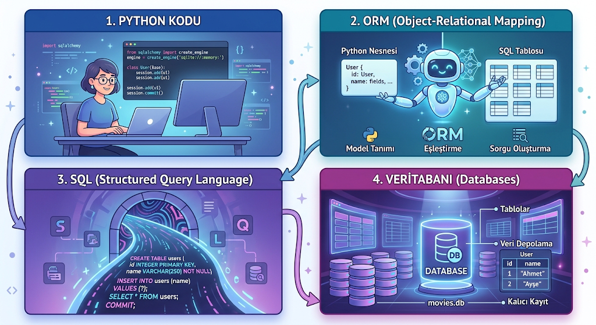

# ORM (Object-Relational Mapping)

## ORM Nedir?

Object-Relational Mapping (ORM), ilişkisel veritabanları (MySQL, MSSQL, SQLite vb.) ile nesne yönelimli programlama (OOP) dilleri arasında bir köprü görevi görür.

Geleneksel yöntemde, veritabanındaki tablolara ve verilere erişmek için SELECT, WHERE, INSERT, UPDATE gibi SQL sorguları doğrudan yazılır. ORM mimarisinde veritabanıyla etkileşim büyük ölçüde programlama dili üzerinden gerçekleştirilir; ORM, arka planda gerekli SQL sorgularını oluşturur ve çalıştırır. Veritabanı tabloları kod içerisindeki sınıflara (class), tablodaki sütunlar ise bu sınıfların özelliklerine (property) dönüşür. Hatta veritabanının kendisi doğrudan kod yazılarak (Code-First yaklaşımıyla) oluşturulabilir.



Veritabanındaki her tablonun bir sınıfa dönüşmesi sayesinde tablolar arası ilişkileri yönetmek, verileri güncellemek ve birbirine bağlı karmaşık işlemleri gerçekleştirmek çok daha kolay ve güvenli hâle gelir.

Buradaki en kritik nokta, ORM'nin temel yapısı gereği ilişkisel veritabanları için tasarlanmış olmasıdır. MongoDB gibi doküman tabanlı NoSQL veritabanlarında "ilişkisel model" bulunmadığı için doğrudan ORM kullanılmaz. Bunun yerine, aynı mantıkla çalışan ve NoSQL dokümanlarını sınıflarla eşleştiren ODM (Object-Document Mapping) araçlarından yararlanılır.

ORM kullanmadan bir SQL sorgusu örneği:

```python
with engine.connect() as connection:

    # SQL sorgusunu doğrudan kendimiz yazıyoruz
    result = connection.execute(
        text("""
            SELECT id, title, type, release_year
            FROM Contents
            WHERE release_year = :year
        """),
        {"year": 2019}
    )

    # Bulunan içerikleri ekrana yazdırıyoruz
    for content in result:
        print(
            content.id,
            content.title,
            content.type,
            content.release_year
        )
```

Burada SQL sorgusunu kendimiz yazıyoruz:

```sql
SELECT id, title, type, release_year
FROM Contents
WHERE release_year = 2019;
```

ORM kullanılarak oluşturulan bir sorgu örneği:

```python
with Session(engine) as session:

    # 2019 yılında yayınlanan içerikleri buluyoruz
    contents = (
        session.query(Content)
        .filter(Content.release_year == 2019)
        .all()
    )

    # Bulunan içerikleri ekrana yazdırıyoruz
    for content in contents:
        print(
            content.id,
            content.title,
            content.type,
            content.release_year
        )
```

Burada SQL sorgusunu doğrudan yazmak yerine Python/SQLAlchemy üzerinden sorgu oluşturuyoruz. Kullandığımız `Content.release_year == 2019` ifadesi, arka planda SQL sorgusuna dönüştürülerek veritabanında çalıştırılıyor.

## Veritabanı Bağlantısı ve Yönetimi

ORM'de hazır bir veritabanına bağlanarak işlemler yapabiliriz veya Code-First yaklaşımıyla sıfırdan bir veritabanı oluşturup işlemler gerçekleştirebiliriz. Eğer oluşturduğumuz veritabanını daha sonra değiştirmek veya farklı bir veritabanı sistemi kullanmak istersek, ORM sayesinde model yapımızı büyük ölçüde koruyarak yalnızca veritabanı bağlantısında değişiklikler yapabiliriz. ORM kullanılmadığında ise veritabanıyla ilgili SQL sorgularının kullanılan veritabanı sistemine göre yeniden düzenlenmesi gerekebilir. Ancak ORM kullanılmayan bir yapıda da veriler manuel olarak yeniden girilmek zorunda değildir; veri taşıma işlemleri SQL araçları veya veritabanı aktarım yöntemleri kullanılarak gerçekleştirilebilir.

ORM ile basit bir SQLite bağlantı örneği:

```python
engine = create_engine("sqlite:///movies.db")
Base = declarative_base()
```

Burada veritabanında değişiklik yapılmasının istendiğini ve SQLite yerine MSSQL kullanılmak istendiğini varsayalım. O zaman ilk satırdaki kodu aşağıdaki şekilde değiştirerek veritabanı bağlantısını kolaylıkla değiştirebiliriz:

```python
connection_string = (
    "mssql+pyodbc://SUNUCU_ADI/VERITABANI_ADI?"
    "driver=ODBC+Driver+17+for+SQL+Server&trusted_connection=yes"
)

engine = create_engine(connection_string)
Base = declarative_base()
```

## Object-Relational Impedance Mismatch

Nesne yönelimli programlama dillerinin veriyi ele alış biçimi ile ilişkisel Veritabanı Yönetim Sistemlerinin (RDBMS) veriyi saklama mantığı arasındaki temel kavramsal ve yapısal farklardan doğan uyuşmazlığa denir.

OOP dünyasında veriler nesneler, sınıflar, referanslar ve davranışlar etrafında, yani pointer'lar ve adresler üzerinden şekillenirken; ilişkisel veritabanlarında tablolar, satırlar, sütunlar ve yabancı anahtarlar (foreign keys) esastır.

#### Temel Uyuşmazlıklar

- **Inheritance (Kalıtım):** Nesne yönelimli programlamada sınıflar birbirinden türeyebilir. Ancak ilişkisel veritabanlarında bunun doğrudan bir karşılığı yoktur; tablolar arasında yalnızca anahtar (primary key) ilişkileri kurulur. Bu sorunu çözmek için Single Table ve Joined Table yöntemleri kullanılır.
- **İlişkiler ve Referanslar:** Nesne yönelimli programlamada bir nesne, bellekteki bir referansı veya adresi işaret eder. İlişkisel veritabanında ise manuel olarak oluşturulan ID'ler ile tablolar arasındaki bağlantılar sağlanır.
- **Nesne ve Kayıt Kimliği:** Nesne yönelimli programlamada aynı adresi belirten birden fazla değişken olabilir (`a == b`). İlişkisel veritabanında ise bir kaydın kimliği primary key'e bağlıdır. Bu nedenle aynı veritabanı satırını temsil eden birden fazla bellek nesnesi olabilir. Bu durum senkronizasyon sorunlarının ortaya çıkmasına sebep olabilir.
- **Encapsulation (Kapsülleme):** Nesne yönelimli programlamada nesneler, metotlarla veriyi sarmalar. Veritabanı ise davranıştan habersiz, yalnızca pasif tablolar tutar.

**Single Table:** Yazılan tüm sınıflar (SQL'deki tablolar) tek bir tablo altında birleştirilir. İlgili verileri ayırmak için `type` tarzı bir alan eklenir ve ortak olmayan özellikler NULL olarak kalır. Hızlı bir çözümdür; ancak alt sınıflara ulaşmak, veri modeli zenginleştikçe ve karmaşıklaştıkça daha zor hâle gelir.

**Joined Table:** Yazılan her sınıf, veritabanında ayrı bir tabloda tutulur. Üst sınıfta ortak alanlar tutulurken alt sınıfta o sınıfa özgü alanlar tutulur. Single Table'daki gibi alt sınıflara ulaşmakta zorluk çıkarmaz ve gereksiz NULL değerlerinin oluşmasını önler. Veri bütünlüğü daha kolay sağlanır; ancak sorgu karmaşıklığı arttıkça işlemler daha yavaş gerçekleşebilir.

**Table Per Concrete Class (TPC):** Ortak nesnelere ait sınıflar için ayrı tablolar oluşturulmaz; ortak alanlar alt sınıflara ait tablolarda tekrar edilir. Yalnızca doğrudan nesnesi üretilebilen alt sınıflar için ayrı ve eksiksiz tablolar oluşturulur.

## ORM Mimarileri

Active Record ve Data Mapper olmak üzere iki mimariye ayrılır.

**Active Record:** Oluşturulan nesneler veritabanı ile bağlantılıdır ve temel veritabanı işlemlerini (CREATE, READ, UPDATE, DELETE) kendileri gerçekleştirir. Bu nedenle basit uygulamalarda tercih edilir ve hızlı bir yöntemdir. Ancak karmaşık uygulamalarda veya sınıfların çok olduğu durumlarda işlemciye ağır bir yük binebilir. Nesneler kendi veritabanı bağlantılarına bağlı olduğundan birim (Unit) testleri yapmak oldukça zordur; çünkü yapılan bir hata veritabanındaki bilgileri bozabilir.

```python
user.save()
user.delete()
```

**Data Mapper:** Oluşturulan nesneler doğrudan veritabanına bağlı değildir. Arada bir mapping yöneticisi bulunur ve veritabanı ile nesne/sınıflar arasındaki ilişkileri yönetir. CRUD işlemlerini de bu yönetici (Session) gerçekleştirir. Veritabanı ile doğrudan bağlantı olmadığı için Unit testleri yapılabilmektedir. Her bir sınıf ayrı ayrı tutulur; daha sonra gelen isteklere göre JOIN ile birleştirilerek veriler sunulur.

Unit of Work yapısına sahiptir. Yani yönetici, bellekte onlarca isteği biriktirir ve daha sonra commit işleminde bu işlemleri denetleyerek son güncellemeleri veritabanında gerçekleştirir.

Bir istek birden fazla kez atılırsa önce Identity Mapping ile gelen isteklerin ID'leri kontrol edilir. Daha sonrasında istenilen cevabın referans değeri geri döndürülür.

```python
session.add(User)
session.delete(User)
```

## Lazy Loading ve Eager Loading

**Lazy Loading:** Nesne ve sınıfları oluşturduğumuzu düşünelim. Veritabanına erişimimiz de mevcut olsun. İlgili nesne üzerinde işlem yapılana kadar veriler veritabanından çekilmez. Bu işlemler, ilgili özellik veya ilişkiye erişildiğinde gerçekleştirilir.

**Eager Loading:** Lazy Loading'in tam tersi olarak, ilişkili veriler nesneler oluşturulurken veya sorgu çalıştırılırken veritabanından alınır.

Bu ikisi arasındaki farkı N+1 problemi ile daha iyi gözlemleyebiliriz.

Bir okulda olduğumuzu ve bu okulda 100 öğretmen bulunduğunu düşünelim. Her öğretmenin de birer adet makalesi olsun.

Lazy Loading yöntemi ile önce öğretmenlerin isimlerini bir kez çekeriz; bu 1 sorgu eder. Daha sonra bir fonksiyon kullanarak bu öğretmenlerin makaleleri için isteklerde bulunuruz; bu da 100 sorgu eder. Toplamda 101 adet sorgumuz bulunur.

Eager Loading yöntemi ile ise JOIN kullanılarak ilişkili öğretmen ve makale tabloları birleştirilir ve veriler birlikte getirilir. Bu da bize 1 adet sorgu yapma imkânı sağlar.

## Bulk Operations

Sorgu sayısını azaltmak için kullanılan bir yöntemdir. CRUD işlemleri toplu olarak gerçekleştirilir ve `session.bulk_save_objects` ile veritabanına gönderilir.
