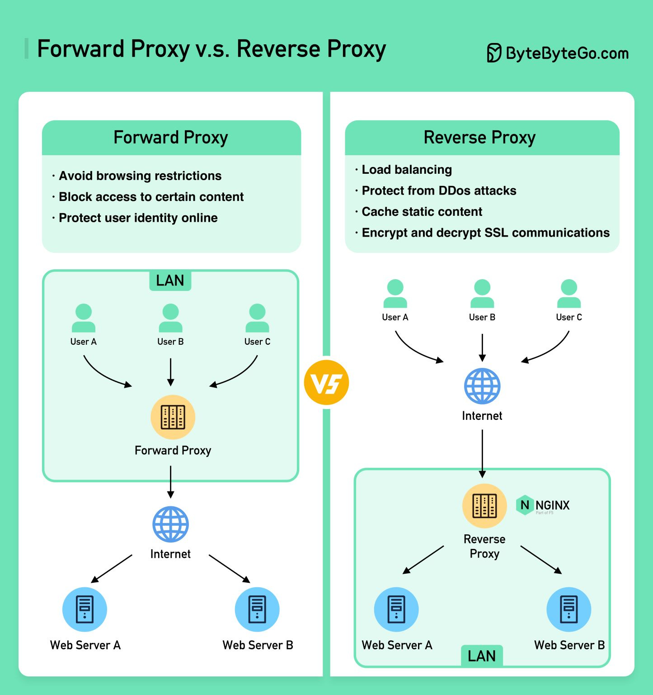

# PROXY
Cihaz ile ağ arasında bulunan bir katmandır. Bu katmanın amacı; web servislerine istekte bulunduğumuz zaman kendi IP adresimizi gizlemek ve cihaz güvenliğini sağlamaktır. Proxy'nin bir artısı ise önbellek (cache) barındırmasıdır. Gönderilen istekler sonucunda gelen yanıtlar bu önbellekte depolanır. Böylece bilgiye daha hızlı ve güvenli bir şekilde erişim sağlanır.

Proxy ile IP gizleme işleminde istemci (client) bir istek gönderir. Bu istekte proxy, IP adresine ve ne istendiğine bakar; ardından kendi IP adresi ile bu isteği ilgili sunucu veya ağdan talep eder. Daha sonrasında gelen veri önce proxy'ye gider ve verinin bir kopyası önbellekte depolanır. Son olarak da veri, proxy'den istemciye iletilir.

Birden fazla cihazın kullanıldığı şirket gibi alanlarda ise işleyiş; yönlendirici (router) ve anahtarlayıcılar (switch) üzerinden sağlanmaktadır. Switch veya router üzerindeki IP adresi gizlenerek ağa bağlanılır; gelen bilgi de önce router ve switch'lere iletilir, sonrasında ilgili bilgisayarlara dağıtılır.

İnternete erişim için proxy şartı yoktur; ancak en yakın proxy servisi ile bağlanmak güvenlik sağlar ve önbellek (cache) sayesinde hız kazandırır.

---

## Proxy Türleri
## Trafik Akışı ve Ağ Mimarisine Göre
- **Forward Proxy:** İstemciler adına hareket eder. İstemciden gelen istekleri alır ve istemcinin IP adresini gizleyerek sunuculara, ağa veya harici kaynaklara iletir. Genel ağlara anonim olarak bağlanmak ve bilgi almak için kullanılır.

- **Reverse Proxy:** Sunucular adına hareket eder. Riskli internet ortamından gelen trafiği kontrol ederek dahili kaynakları korumak için kullanılır. Ters proxy'ler; sunucuların kimliğini gizlemek, kimlik doğrulama, şifre çözme, yük dengeleme, önbelleğe alma ve sıkıştırma işlemleri için kullanılır.

### Protokol ve Katman Düzeyine Göre
- **HTTP:** Genellikle web tarayıcılarında web trafiğini yönlendirmek için kullanılır. İstek başlıklarını okuyabilir, filtreleyebilir veya içeriği önbelleğe alabilir. OSI modelinde Uygulama (Application) katmanında çalışır.
- **HTTPS (SSL):** SSL/TLS ile verileri şifreleyerek istemci ile sunucu arasındaki trafiğin güvenli bir şekilde aktarılmasını sağlar.
- **SOCKS:** İnternet trafiğini sadece web siteleri için değil, her tür uygulama için yönlendirebilir. OSI modelinde Oturum (Session) katmanında yer alır.

### Anonimlik ve Gizlilik Seviyesine Göre
- **Transparent:** Bu proxy türünde diğerlerinden farklı olarak IP adresi gizlenmez. "Zorunlu proxy" olarak da bilinir. Bunun nedeni, son kullanıcı istemcisinin onayı olmaksızın ağ geçidi (gateway) seviyesinde zorunlu olarak uygulanabilmesidir. Genelde kurum içi içerik filtrelemelerinde veya erişim denetimlerinde kullanılır. Örneğin, bir kullanıcının kurumun izin vermediği bir siteye ulaşmaya çalıştığını düşünelim; istek proxy'ye ulaşır, proxy erişim izni olmadığını tespit eder ve kullanıcıya sitenin engellendiğine dair bir yanıt iletir.
- **Elite:**  Hem gerçek IP adresinizi gizler hem de istekte proxy kullanıldığına dair hiçbir iz bırakmaz. Hedef sunucu, isteğin doğrudan o IP'ye ait bir cihazdan geldiğini varsayar. En yüksek anonimlik düzeyine sahip vekil sunucu (proxy) türüdür.

# Nginx
Nginx (engine x), aslen _mail.ru_ isimli Rus mail sitesi için Rus yazılım mühendisi Igor Sysoev tarafından geliştirilen; hafif, stabil ve hızlı bir mail proxy (vekil) sunucusu olarak kodlanan, daha sonraları geliştirilerek tüm yapılar için uygun hale getirilen bir web sunucusudur.

Alternatifleri olan Apache HTTP Server ve Lighttpd ile kıyaslandığında, duruma göre %400'e varan oranda daha performanslı olduğu ve çok daha az CPU/RAM kullandığı tespit edilmiştir.

### Temel Özellikler
- Reverse Proxy (Ters Vekil Sunucusu)
- Load Balancing (Yük Dengeleme)
- Virtual Host (Server Blocks)
- Statik ve index dosyalarının sunumu, otomatik indeksleme.

### Neden Kullanılır?
- **Düşük RAM ve CPU Kullanımı:** Olay güdümlü (event-driven) ve asenkron mimarisi sayesinde, donanımı yormadan eşzamanlı olarak binlerce isteği kesintisiz bir şekilde halleder.

- **Reverse Proxy Yapısı:** Arka plandaki asıl sunucunun IP ve port numaralarını gizleyerek sunucu güvenliğini sağlar. Dış dünyadan gelen istekleri karşılayıp iç sunuculara dağıtır.

- **Load Balancing (Yük Dengeleme):** İlgili web sitesine milyonlarca kişi girdiğinde, bu istek yoğunluğunu arkadaki birden fazla sunucuya dağıtır. Böylece tek bir sunucunun çökmesi önlenir. İstek dağıtımında şu popüler algoritmalar kullanılır:
  - *Round Robin:* İstekleri sırayla sunuculara dağıtır (Varsayılan yöntemdir).
  - *Least Connections:* O an yoğunluğu en az olan, yani en az bağlantıya sahip sunucuya istekleri yönlendirir.
  - *IP Hash:* Kullanıcının IP adresine göre hep aynı sunucuya gitmesini sağlar. Yani A kullanıcısından gelen tüm istekler hep C sunucusuna iletilir. Bu sayede A kişisi hep aynı sunucuyla irtibatta kaldığı için (ortak bir session veritabanı yoksa bile) oturumu kapanmaz ve veri kaybı yaşamaz.

- **Virtual Host / Server Blocks:** Tek bir fiziksel sunucu ve tek bir IP adresi üzerinde birden fazla bağımsız web sitesinin (domainin) barındırılabilmesini sağlar.

- **Statik ve Index Dosyalarının Sunumu:** Resim, CSS, JS gibi sabit dosyaların sunumunda `sendfile` gibi işletim sistemi seviyesindeki kernel özelliklerini kullanarak dosyayı doğrudan diskten alıp ağ kartına aktarır (uygulama sunucusuna yük bindirmez). Kullanıcı doğrudan bir klasör dizinine erişmek istediğinde ise Nginx o klasörün içinde varsayılan olarak hangi dosyanın açılacağını belirler (Genellikle `index.html` veya `index.php`).

- **Otomatik İndeksleme (Autoindex):** Klasörün içinde bir index dosyası yoksa ve bu özellik aktifse, Nginx o klasörün içeriğini bir dosya gezgini gibi listeler. Kullanıcı klasördeki tüm dosyaları ve alt klasörleri listelenmiş olarak görür ve indirebilir. Güvenlik nedeniyle canlı sistemlerde genellikle kapalı tutulur.

