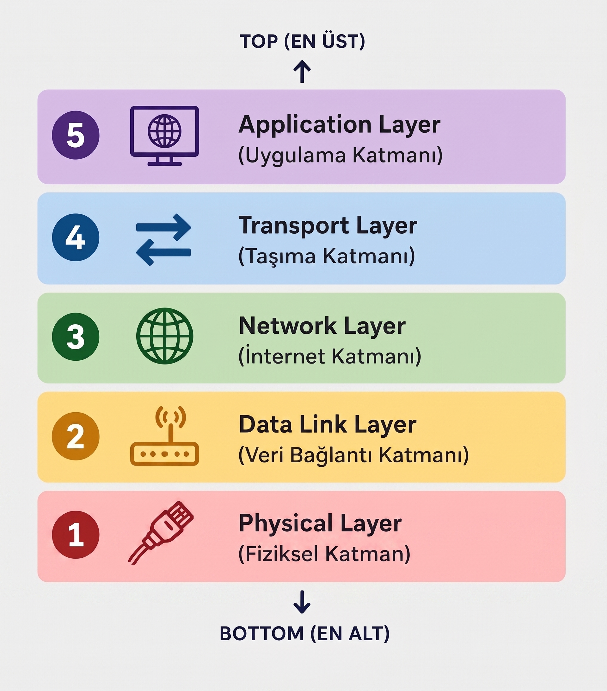
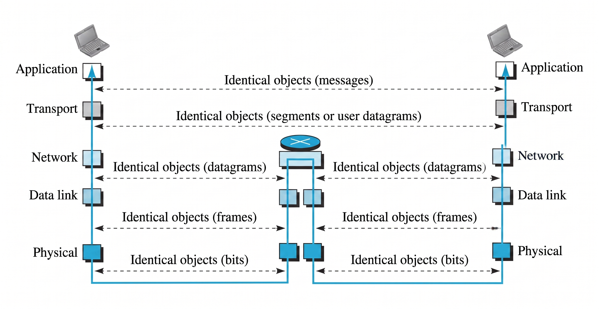
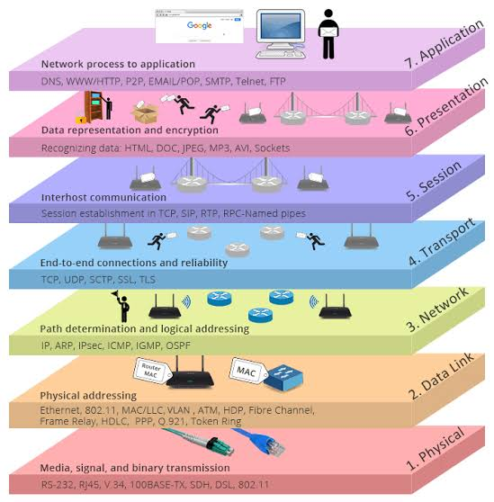
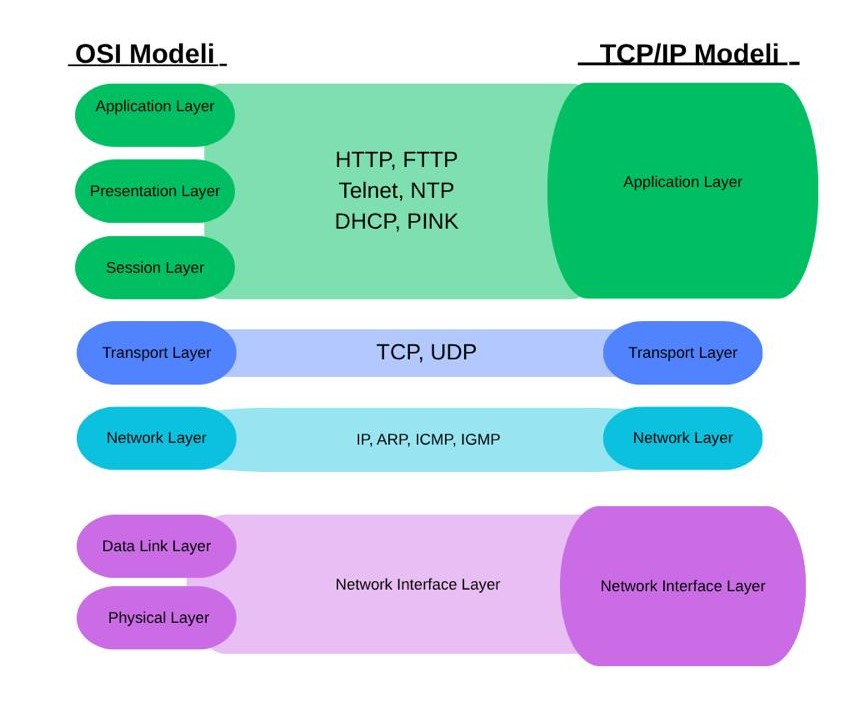

# TCP/IP Protokol Ailesi
TCP/IP, iki veya daha fazla bilgisayarın bir ağ üzerinden birbiriyle iletişim kurmasını sağlayan bir protokol ailesidir. Adını, bu protokol ailesinin temel protokollerinden olan **Transmission Control Protocol (TCP)** ve **Internet Protocol (IP)** protokollerinden alır. TCP, gönderilen verilerin güvenilir ve sıralı bir şekilde hedefe ulaştırılmasını sağlarken IP, verilerin kaynak ve hedef adreslerini belirleyerek ağlar üzerinden doğru hedefe yönlendirilmesini sağlar. TCP'nin güncel temel spesifikasyonu RFC 9293 (2022) ile tanımlanmıştır.

TCP/IP protokol ailesi, farklı görevleri yerine getiren katmanlardan oluşur. Her katmanın kendine özgü görevleri bulunur ve verinin gönderici cihazdan alıcı cihaza ulaşması sırasında bu katmanlar birlikte çalışır.

## 1. Physical Layer — Fiziksel Katman

Bu katmanda veriler, 0 ve 1'lerden oluşan bitler hâlinde karşı tarafa iletilir. Bitler; bakır kablolarda elektriksel sinyaller, fiber optik kablolarda optik sinyaller ve kablosuz iletişimde radyo sinyalleri aracılığıyla taşınır. Alıcı taraf, gelen sinyalleri tekrar bitlere dönüştürerek bir sonraki katmana iletir.

## 2. Data Link Layer - Veri Bağlantı Katmanı

Network Layer'dan alınan paketlere MAC adresleri ve kontrol bilgileri eklenerek frame'ler oluşturulur. Oluşturulan frame'ler, fiziksel katman üzerinden iletilmek üzere bitlere dönüştürülür.

## 3. Network Layer - Ağ Katmanı

Bu katman, source ve destination host, yani kaynak ve hedef cihaz arasında verilerin iletilmesinden sorumludur. Kaynak ve hedef cihazların belirlenmesi IP adresleri aracılığıyla gerçekleştirilir. Bu katmandaki iletişim host-to-host olarak adlandırılır.

Paketlerin farklı ağlar üzerinden hedefe ulaştırılması gerektiğinde router'lar, hedef IP adresini kullanarak uygun yolu belirler ve paketi bir sonraki noktaya iletir.

## 4. Transport Layer - Taşıma Katmanı

Taşıma katmanı, uygulama katmanından gelen verilerin kaynak cihaz ile hedef cihaz arasında uçtan uca (end-to-end) iletilmesinden sorumludur. Bu katmanda temel olarak TCP (Transmission Control Protocol) ve UDP (User Datagram Protocol) protokolleri çalışır.

TCP, bağlantı kurulmasını, veri akışının kontrol edilmesini ve verilerin güvenilir bir şekilde iletilmesini sağlar. TCP bağlantısı kurulmadan önce Three-Way Handshake (Üç Aşamalı El Sıkışma) işlemi gerçekleştirilir. Bu işlemde öncelikle gönderici SYN mesajı gönderir. Alıcı bu mesajı aldığında SYN-ACK mesajı ile yanıt verir. Gönderici de ACK mesajını göndererek bağlantı kurulmasını tamamlar. Bağlantı kurulduktan sonra veri gönderimi başlar.

TCP, gönderilen verilerin güvenilir bir şekilde iletilmesini sağlamak için ACK, sıra numaraları ve yeniden iletim gibi mekanizmalar kullanır. Verilerin eksik veya hatalı ulaşması durumunda gerekli verilerin yeniden gönderilmesini sağlar. Ayrıca verilerin doğru sırayla teslim edilmesini ve veri akışının kontrol edilmesini sağlar.

UDP ise TCP'nin aksine bağlantı kurulumu gerçekleştirmez ve gönderilen verilerin hedefe ulaşıp ulaşmadığını kontrol etmez. Bu nedenle UDP'de yeniden iletim ve akış kontrolü gibi işlemler bulunmaz. Bu durum, UDP'nin TCP'ye göre daha hızlı ve daha düşük ek yükle çalışmasını sağlar. Ancak veri kaybına karşı TCP kadar güvenilir değildir.

Basitçe anlatmak gerekirse, uygulama katmanından gelen veri taşıma katmanında TCP kullanılıyorsa segment adı verilen veri birimlerine ayrılır ve hedef cihazın taşıma katmanına gönderilir. Hedef cihazda segment içerisindeki veri üst katmana aktarılır ve uygulamanın kullanabileceği hâle getirilir.

## 5. Application Layer - Uygulama Katmanı

Uygulama katmanı, kullanıcıların kullandığı uygulamaların ağ üzerinden iletişim kurmasını sağlayan katmandır. Web sayfalarına erişme, dosya transferi, e-posta gönderme ve alan adı çözümleme gibi farklı işlemler için farklı protokoller kullanılır. HTTP, FTP, SMTP ve DNS bu katmanda çalışan protokollere örnek olarak verilebilir.

Bu katmanda çalışan protokoller, uygulamaların ağ üzerinden belirli hizmetleri gerçekleştirmesini sağlar. Uygulama katmanı ile taşıma katmanı arasındaki iletişim port numaraları aracılığıyla gerçekleştirilir. Port numaraları, gelen veya gönderilen verinin cihaz üzerindeki hangi uygulama veya process (süreç) ile ilişkilendirileceğini belirlemeye yardımcı olur.

Bu nedenle uygulama katmanındaki iletişim process-to-process (süreçten sürece) olarak ifade edilir. Kaynak cihazdaki bir uygulama tarafından oluşturulan veri, ilgili port üzerinden taşıma katmanına aktarılır. Taşıma katmanı, bu veriyi uygun şekilde işleyerek ağ üzerinden hedef cihaza gönderir. Hedef cihazda ise taşıma katmanı tarafından alınan veri, port numarası aracılığıyla ilgili uygulamaya veya process'e teslim edilir.

Basit bir ifadeyle, uygulama katmanı ağ üzerinde hangi hizmetin gerçekleştirileceğini ve hangi uygulamanın iletişim kuracağını belirleyen katmandır.

- Veri, gönderici tarafta Application katmanından başlayarak aşağı doğru ilerler ve her katmanda ilgili bilgiler eklenerek bir sonraki katmana aktarılır. Transport katmanında segment, Network katmanında paket, Data Link katmanında frame oluşturulur. Physical katmanında ise veriler bitler hâline getirilerek fiziksel ortam üzerinden karşı tarafa gönderilir. Alıcı tarafta ise bu işlem tersine gerçekleşir; bitler sırasıyla frame, paket ve segment hâline getirilerek Application katmanına ulaştırılır.

# Open Systems Interconnection (OSI)

OSI modeli, ISO (International Organization for Standardization) tarafından bir bilgisayar ağı üzerindeki cihazlar arasındaki ağ iletişimini standartlaştırmak ve farklı sistemlerin ağlarda nasıl iletişim kurduğunu açıklamak için geliştirilen bir iletişim modeli standardıdır.

OSI modeli, ağ üzerinden gerçekleştirilen iletişimi farklı görevlerden sorumlu katmanlara ayırarak yazılım ve donanım bileşenlerinin iletişim sürecinin anlaşılmasını kolaylaştırır. Her katman, kendisine verilen belirli görevleri yerine getirir ve verinin bir üst veya alt katmana aktarılmasını sağlar.

OSI modeli, düzeyler arasında kullanılacak protokolleri değil, protokollerin gerçekleştirdiği görevleri belirtir.

OSI modeli 7 adet katmandan oluşmaktadır. TCP/IP protokol ailesinden farklı olarak Session (oturum) ve Presentation (Sunum) katmanları bulunur.

## Session Layer - Oturum Katmanı

İki uygulama arasındaki ağ koordinasyonundan sorumludur. Uygulamalar arasındaki oturumun başlatılması, sürdürülmesi, oturum sırasında veri alışverişinin düzenlenmesi ve oturumun sonlandırılması gibi işlevleri gerçekleştirir. Bu katmanla ilişkili uygulamalara Ağ Dosya Sistemi (NFS) ve Sunucu İleti Bloğu (SMB) örnek olarak verilebilir. Ayrıca uzun süren veri alışverişlerinde senkronizasyon noktaları oluşturarak iletişimin belirli bir noktadan devam etmesine yardımcı olabilir.

**NFS:** Bir bilgisayardaki dosya ve klasörlere ağ üzerinden başka bir bilgisayardan erişmeyi sağlayan bir dosya sistemidir. Bunu Google Drive'daki ortak bir klasöre erişmeye benzetebiliriz.

**SMB:** Ağ üzerindeki dosya, klasör, yazıcı gibi kaynakların paylaşılmasını ve bu kaynaklara erişilmesini sağlayan bir iletişim protokolüdür.

## Presentation Layer - Sunum Katmanı

Bu katman, verilerin farklı sistemler ve uygulamalar tarafından anlaşılabilecek ortak bir formata dönüştürülmesini sağlar. Böylece farklı cihazlarda veya farklı işletim sistemlerinde çalışan uygulamaların verileri doğru şekilde yorumlayabilmesine yardımcı olur. Aynı zamanda veri biçimi dönüşümü, karakter kodlama, veri şifreleme ve şifre çözme, veri sıkıştırma ve sıkıştırılmış verinin açılması gibi işlemlerle ilgilenir.

Örneğin HTML, JSON ve CSV, verilerin farklı sistemler arasında yapılandırılmış bir biçimde temsil edilmesinde kullanılan veri formatlarına örnek olarak verilebilir. JPEG, GIF ve TIFF gibi formatlar ise görüntü verilerinin temsil edilmesinde kullanılır. ASCII ve EBCDIC ise karakterlerin bilgisayar sistemlerinde nasıl kodlanacağını belirleyen karakter kodlama sistemlerine örnektir.

# OSI ve TCP/IP Arasındaki İlişki ve Farklılıklar

OSI ve TCP/IP modelleri, ağ iletişimini katmanlara ayırarak ağ üzerinde gerçekleşen veri iletişiminin daha anlaşılır hâle getirilmesini amaçlar. Her iki modelde de benzer ağ görevleri farklı katmanlara ayrılmıştır. Ancak OSI modeli, ağ iletişimini açıklamak için oluşturulmuş 7 katmanlı bir referans modelken, TCP/IP gerçek ağ iletişiminde kullanılan protokolleri temel alan bir protokol ailesi ve katmanlı modeldir. Bu nedenle iki modelin katman yapıları ve görevlerin katmanlara dağılımı arasında bazı farklılıklar bulunmaktadır.

### Farklılıklar

* TCP/IP 5 katmandan oluşurken OSI 7 katmandan oluşmaktadır.
* OSI modelinde Application, Presentation ve Session katmanları ayrı olarak bulunurken, TCP/IP modelinde bu katmanların görevleri büyük ölçüde Application Layer içerisinde ele alınır.
* TCP/IP gerçek ağlarda ve internet iletişiminde yaygın olarak kullanılırken, OSI modeli daha çok ağ iletişimini açıklamak, öğrenmek ve analiz etmek için kullanılan bir referans modeldir.
* OSI modeli, katmanların görevlerini ve katmanlar arasındaki hizmet ilişkilerini daha ayrıntılı şekilde tanımlar. TCP/IP modeli ise daha esnek bir yapıya sahiptir ve protokollerin katmanlara yerleştirilmesi OSI'deki kadar katı değildir.

# Kaynaklar
- https://acikders.ankara.edu.tr/pluginfile.php/155285/mod_resource/content/0/10.2.%20TCP%20IP%20Modeli.pdf
- https://bidb.itu.edu.tr/seyir-defteri/blog/2013/09/07/tcp-ip-protokolu
- https://www.scribd.com/document/1053873910/BA-01https://www.scribd.com/document/1053873910/BA-01
- https://medium.com/t%C3%BCrk-telekom-bulut-teknolojileri/osi-katmanlar%C4%B1-92a2436e6900
- https://www.priviasecurity.com/blog/osi-ve-tcp-ip-modelleri-ve-farkliliklari/
